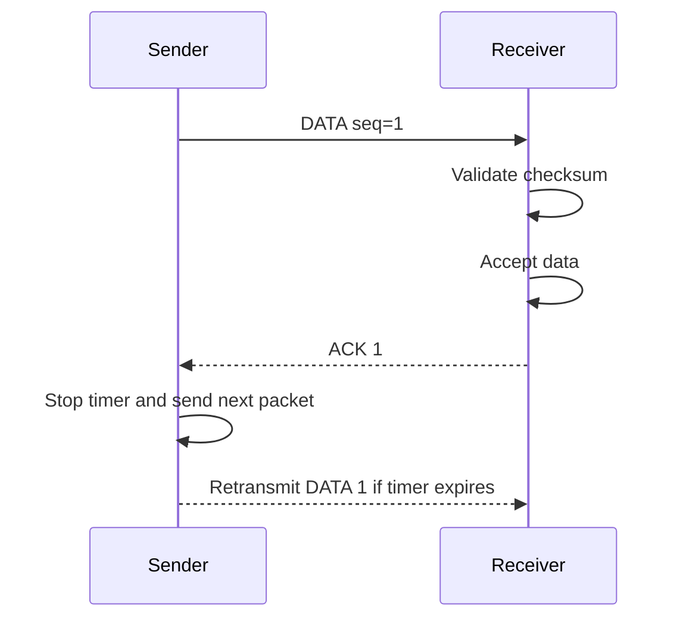
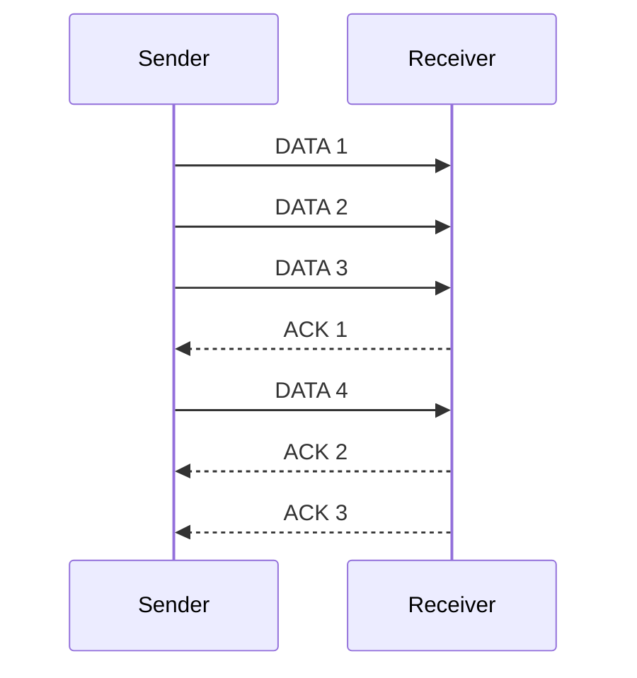

# Reliable Protocol Lab

> **Computer Networks practice** | Reliable data transfer over UDP

This project implements **stop-and-wait ARQ** in C. The framework calls the protocol functions in [`21_reliable/reliable.c`](21_reliable/reliable.c).

## What I Implemented

| Callback | What it does |
| --- | --- |
| `connection_initialization` | Initializes sequence numbers, timeout, and state. |
| `send_callback` | Reads data, sends one packet, starts timer `0`, and pauses new data. |
| `receive_callback` | Validates packets, processes ACKs, accepts ordered data, and sends ACKs. |
| `timer_callback` | Retransmits the last packet if its ACK does not arrive. |

## Stop-and-Wait: Implemented ✅

Only one packet is pending at a time. The sender does not advance to packet `N + 1` until it receives ACK `N`.



`last_data` stores the current payload so the timer callback can retransmit it with the same sequence number.

## Sliding Window: Not Implemented Yet 🚧

Sliding window allows several packets to be sent before waiting for ACKs, improving throughput:



This is an optional extension. The current code intentionally uses a window size of `1`.

## Run It

From WSL, enter the exercise directory and compile it:

```bash
cd ~/mi_practica_reliable/21_reliable
make
```

Open two WSL terminals:

```bash
./reliable 5555 127.0.0.1:6666 -d 2
```

```bash
./reliable 6666 127.0.0.1:5555 -d 2
```

Test corruption with `-e 10`. Stop either endpoint with `Ctrl+C`.

For example, to enable 10% packet corruption on the first endpoint:

```bash
./reliable 5555 127.0.0.1:6666 -d 2 -e 10
```

## Test Result

The following local run shows packets, checksum validation, ACKs, timers, and transmission resuming after acknowledgement:


## Files

- [`reliable.c`](21_reliable/reliable.c): protocol logic we implemented.
- [`rlib.h`](21_reliable/rlib.h): framework API and packet definitions.
- [`rlib.c`](21_reliable/rlib.c): framework internals; do not modify.
