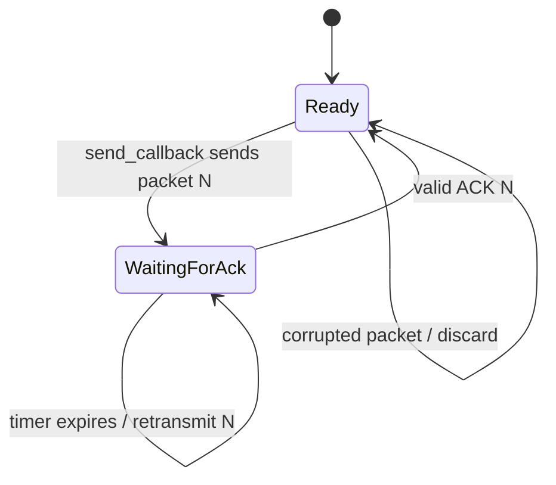

# Reliable Data Link Protocol

A small C networking project that implements a reliable stop-and-wait data link protocol on top of the provided UDP framework.

The project is part of a computer networks lab focused on flow control, acknowledgements, checksums, timers, and retransmissions.

## Contents

- [What This Project Does](#what-this-project-does)
- [Project Layout](#project-layout)
- [Protocol At A Glance](#protocol-at-a-glance)
- [How The Code Works](#how-the-code-works)
- [Build](#build)
- [Run Two Local Endpoints](#run-two-local-endpoints)
- [Test With Errors](#test-with-errors)
- [Debugging](#debugging)
- [Current Scope](#current-scope)

## What This Project Does

The program transfers application data reliably between two endpoints. Each endpoint runs the same executable and communicates through UDP.

The protocol uses **stop-and-wait ARQ**:

1. The sender transmits one data packet.
2. The sender starts a retransmission timer and pauses new application data.
3. The receiver validates the checksum and accepts data only when it has the expected sequence number.
4. The receiver sends an acknowledgement (ACK).
5. The sender clears the timer and resumes transmission after receiving the expected ACK.
6. If the timer expires first, the sender retransmits the same packet.

## Project Layout

| File | Purpose |
| --- | --- |
| [`21_reliable/reliable.c`](21_reliable/reliable.c) | Student protocol implementation and callbacks. |
| [`21_reliable/rlib.h`](21_reliable/rlib.h) | Framework API, packet definitions, and documentation. |
| [`21_reliable/rlib.c`](21_reliable/rlib.c) | Framework implementation. It should not be modified. |
| [`21_reliable/Makefile`](21_reliable/Makefile) | Build, debug, and clean commands. |

## Protocol At A Glance



### Packet Types

| Packet | Size | Important field |
| --- | ---: | --- |
| ACK-only packet | 8 bytes | `ackno` confirms a data packet. |
| Data packet | 12 to 512 bytes | `seqno` identifies the packet and `data` contains the payload. |

The data packet header is 12 bytes, so the payload size is calculated as:

```text
payload_size = packet_length - DATA_PACKET_HEADER
```

Sequence numbers start at `1`.

## How The Code Works

### `connection_initialization`

Initializes the stop-and-wait state:

- stores the timeout value;
- starts sending and receiving sequence numbers at `1`;
- marks the sender as ready;
- resets the last payload size.

The `window_size` argument is intentionally ignored because this implementation uses a window of one packet.

### `send_callback`

Called when the application has data available. It:

- reads up to `MAX_PAYLOAD` bytes with `READ_DATA_FROM_APP_LAYER`;
- stores those bytes in `last_data` for possible retransmission;
- sends the packet with `SEND_DATA_PACKET`;
- starts timer `0`;
- pauses new application data until the ACK arrives.

### `receive_callback`

Called for every received packet. It:

- validates the checksum before trusting packet fields;
- processes ACK packets and resumes transmission after the expected ACK;
- accepts data only when its sequence number is the expected one;
- sends an ACK for accepted data;
- sends another ACK for duplicates without delivering duplicate data.

### `timer_callback`

Called when a framework timer expires. For timer `0`, it retransmits the saved payload with the same sequence number and starts the timer again.

Keeping the same sequence number is essential: a timeout means that the current packet has not been confirmed, not that a new packet should be created.

## Build

Run these commands from the project directory:

```bash
cd ~/mi_practica_reliable/21_reliable
make
```

Build a debug version with symbols:

```bash
make debug
```

Remove the generated executable:

```bash
make clean
```

The executable is named `reliable` and is generated inside `21_reliable/`.

## Run Two Local Endpoints

Open two WSL terminals. In both terminals:

```bash
cd ~/mi_practica_reliable/21_reliable
```

Terminal A listens on port `5555` and sends to port `6666`:

```bash
./reliable 5555 127.0.0.1:6666 -d 2
```

Terminal B listens on port `6666` and sends to port `5555`:

```bash
./reliable 6666 127.0.0.1:5555 -d 2
```

Write a line in either terminal. The receiving endpoint should display the delivered data.

Stop each running endpoint with `Ctrl+C`.

## Test With Errors

The framework can corrupt packets with a configurable probability. To test retransmissions, use the `-e` option:

```bash
./reliable 5555 127.0.0.1:6666 -e 10 -d 2
```

```bash
./reliable 6666 127.0.0.1:5555 -e 10 -d 2
```

Useful error rates for the lab are `5`, `10`, and `25` percent.

The protocol should continue delivering data in order. Corrupted packets should not be accepted, and missing ACKs should eventually cause retransmission.

## Synthetic Traffic

Use `-s` on both endpoints to enable the synthetic traffic generator:

```bash
./reliable 5555 127.0.0.1:6666 -s -d 1
```

```bash
./reliable 6666 127.0.0.1:5555 -s -d 1
```

The statistics printed by the framework distinguish transmitted traffic from data accepted by the application. Retransmissions can make those values different, especially when errors are enabled.

## Debugging

The `-d` option controls framework debug output:

| Level | Output |
| ---: | --- |
| `1` | Basic protocol activity. |
| `2` | Packets, checksums, and timers. |
| `3` | More detailed framework diagnostics. |

Messages labelled `ERRORS` are a debug category. A line such as `Packet checksum validation: OK` means validation succeeded; it is not an actual failure.

## Current Scope

This repository currently implements the required **stop-and-wait** protocol with retransmission on timeout.

Sliding-window support is not part of the current implementation. The framework accepts a `-w` option for that optional extension, but this protocol intentionally operates with a window size of `1`.

## Learning Notes

The most important invariant is:

```text
Do not advance to packet N + 1 until ACK N has been received.
```

When a timeout occurs, retransmit packet `N` with the same data and the same sequence number. This prevents lost ACKs from creating duplicate application data.
